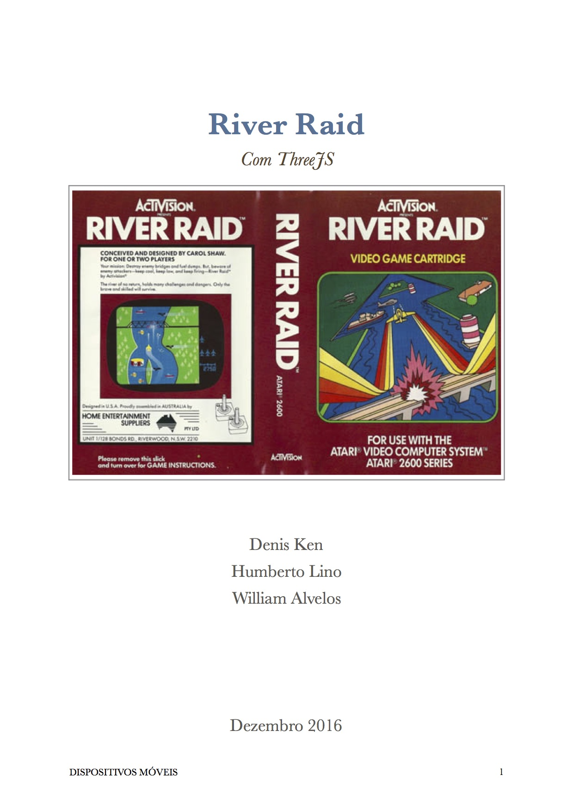

#ENUNCIADO

Desenvolver um jogo em 3D, baseado no clássico RiverRaid de Atari.

**ENTREGA: 01 Dezembro de 2016**

## REQUISITOS

Grupos de até 4 alunos;

* O jogo precisa, necessariamente, ser em 3D;
* O jogo deve ser desenvolvido para celulares ou tablets, em Android, iOS ou HTML5;
* Não é permitido o uso de Game Engines (Unity, Unreal, etc). Apenas bibliotecas 3D (ThreeJS, JOGL, etc).

## AVALIAÇÃO

A nota será dada pela soma das funcionalidades da lista abaixo que forem implementadas corretamente:

1. **5 pts** Funcionamento básico da nave (movimento direita/esquerda) e colisão com terreno;
2. **1pt** Manual do jogo em PDF (captura de tela, funcionamento e descrição da implementação);
3. **1.5pts** Geração de terreno de forma procedural;
4. **1pt** Score de pontos (pontuação atual e recordes);
5. **1pt** Controle de combustível (marcador de nível e postos de abastecimento);
6. **1pt** Controle de câmera;
7. **0.5pt** Controle de aceleração (movimento frente/trás);
8. **1pt** Helicópteros (com colisão e explosão por tiros);
9. **1pt** Barcos (com colisão e explosão por tiros);
10. **1pt** Pontes (com colisão e explosão por tiros);
11. **1pt** Avião Azul (com colisão e explosão por tiros);
12. **0.5pt** Sonorização (efeitos sonoros e música);

### OBS: 

Para quem não conhece o jogo original, consulte a [Wikipedia] (https://en.wikipedia.org/wiki/River_Raid) ou o [Youtube](https://www.youtube.com/watch?v=pmPjsBDN9Xw).

**O jogo é bem simples.**

## Documentação

[Itens Atendidos na avaliação](doc/river-raid.pdf)

## Dependências

1. [threejs.org](https://threejs.org)
2. [greensock.com/tweenmax](https://greensock.com/tweenmax)

## Referências

1. [River Raid Manual](http://www.gamesdatabase.org/Media/SYSTEM/Atari_2600/Manual/formated/River_Raid_-_1982_-_Activision.pdf)
2. [Gradient Picker Color](http://uigradients.com/#BetweenNightandDay)

